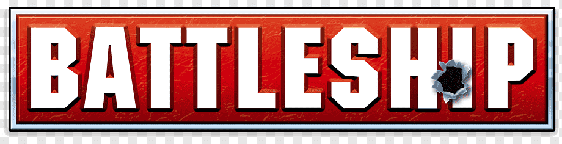

  

# Battleship

This repository holds the Java and C++ version of a Battleship game, created during the Object Oriented Programming course, completed during my first year of studies in the Computer Engineering and Informatics Department at the University of Patras. 

# Structure

In the Java folder, you can find the Java version of the game, and in the C++ folder you can find the corresponding version of the game, written in the C++ programming language.

